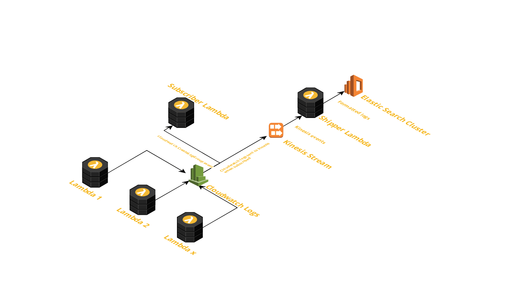

# Lambda Logs Shipper

Subscribe to log groups from all the lambdas, and stream logs to kinesis stream. A lambda subscribe to kinesis event, formats the logs, and ships to ES cluster.

# Architecture

